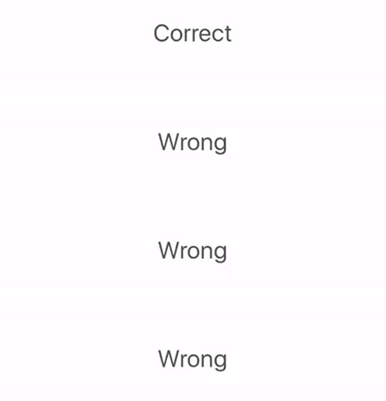

# UIButton+Game

[](https://travis-ci.org/steveholt55/UIButton-Game)

**UIButton+Game** is a UIButton extension that makes it easy to animate a button with a pulse animation after a correct guess and a shake animation after an incorrect guess. 

Pre-requisites
--------------
- iOS 8 and Swift 3

Installation
------------

#### Copying files into project
```
UIButton+Game.swift
```  

Preview
-----------




Basic usage
-----------

```swift
let gameButton = UIButton()

gameButton.correct {
	//Do something following animation
}

gameButton.incorrect {
	//Do something following animation
}

```

Customization
-----------

```swift
let gameButton = UIButton()

// Color
gameButton.positiveColor = .green // Color on correct guess
gameButton.negativeColor = .red   // Color on incorrect guess 

// Animation Duration
gameButton.positiveAnimationDuration = 1.0 // How long to show correct animation
gameButton.negativeAnimationDuration = 1.0 // How long to show incorrect animation 

```

License
---------------
This project is released under the MIT license. See LICENSE for details.
